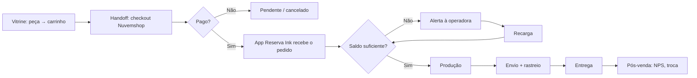

# PRD — Indicio Cult

**Product Requirements Document — E-commerce de arte impressa (Print on Demand)**

| Campo             | Valor                                                                                                                                                                                                 |
| ----------------- | ----------------------------------------------------------------------------------------------------------------------------------------------------------------------------------------------------- |
| Produto           | Indicio Cult — loja virtual de arte impressa                                                                                                                                                          |
| Assinatura        | _Arte para quem reconhece o indício._                                                                                                                                                                 |
| Versão            | 1.2                                                                                                                                                                                                   |
| Status            | Em revisão                                                                                                                                                                                            |
| Premissas fixadas | Checkout delegado à Nuvemshop; autenticação via Supabase (e-mail/senha + Google); frete via API Reserva Ink; fulfillment POD via Reserva Ink                                                          |
| Identidade        | Paleta e tipo da vitrine definidos no Figma (não reabrir). Stack do frontend: [ADR-001](decisions/ADR-001-stack-frontend-cache-estado-e-deploy.md).                                                   |
| Alinhamento UI    | Home, header e rodapé alinhados ao arquivo Figma [Indicio Cult](https://www.figma.com/design/rakcFK2hEb9f9wktHDAVET/Indicio-Cult) (Home Desktop `8:110`, Home Mobile `38:41`).                         |
| Em aberto         | Questões operacionais em §20                                                                                                                                                                          |

---

## 1. Resumo executivo

A Indicio Cult é uma marca de **arte impressa para pessoas de repertório específico**. Seu primeiro produto é uma loja virtual de camisetas com estampas autorais, operando em **Print on Demand (POD)** — sem estoque, com produção e envio acionados a cada pedido pela Reserva Ink.

O e-commerce não deve parecer uma "loja de camisetas cult". Deve se comportar como um **espaço editorial**: coleções são séries, produtos são obras, a navegação é curadoria. A camiseta é o primeiro suporte; posters e quadros entram no roadmap.

A arquitetura é **headless**: a vitrine (Home, séries, peças, editorial, conta) é própria; **carrinho final, checkout, pagamento e registro do pedido são delegados à Nuvemshop** ([API](https://dev.nuvemshop.com.br/en/docs/developer-tools/nuvemshop-api)). A Reserva Ink, integrada à Nuvemshop pelo app oficial, produz e envia; sua [API pública](https://developers.reserva.ink) alimenta a simulação de frete na vitrine e o monitor de saldo no backoffice.

---

## 2. Contexto e problema

**Mercado.** Camisetas estampadas online estão saturadas em duas pontas: fast fashion genérica (preço) e nicho geek/pop (referência óbvia, humor, fandom). Falta oferta para quem consome cinema de autor, literatura, artes plásticas e crítica cultural e não se identifica com a estética geek.

**Usuário.** _"Quero vestir algo que diga quem eu sou sem precisar explicar. As camisetas 'cult' parecem piada interna de fórum; as de marca são vazias."_

**Negócio.** Validar se o posicionamento de _arte impressa_ sustenta ticket médio e recompra acima do segmento, operando com uma pessoa (curadoria, conteúdo, atendimento) e produção/logística terceirizadas.

### 2.1 Premissas operacionais

| Premissa                                                                       | Implicação                                                                                                            |
| ------------------------------------------------------------------------------ | --------------------------------------------------------------------------------------------------------------------- |
| Checkout, pagamento (Pix e cartão via Nuvem Pago) e pedidos vivem na Nuvemshop | A vitrine não implementa checkout nem armazena dados de pagamento. Pedidos são lidos via API/webhooks da Nuvemshop.   |
| Fulfillment pela Reserva Ink via app oficial na Nuvemshop                      | Pedidos aprovados vão automaticamente para produção. Não há integração customizada de pedidos.                        |
| Reserva Ink só produz com **saldo pré-pago** suficiente (custo + frete)        | O backoffice precisa de **monitor de saldo** (`GET /v1/stores/balance`) com alertas.                                  |
| Plano inicial da Reserva Ink limitado a ~20 vendas/mês                         | Fase de validação; contador de vendas do mês evidencia o momento de upgrade.                                          |
| Frete calculado na vitrine pela API da Reserva Ink                             | Estimativa sobre produto de referência (camiseta padrão); valor final é o do checkout Nuvemshop.                      |
| Autenticação própria via Supabase                                              | Conta da vitrine (favoritos, endereços, histórico) é separada da conta Nuvemshop; pedidos são vinculados pelo e-mail. |

---

## 3. Posicionamento e princípios

- **Somos:** marca de arte impressa para pessoas de repertório específico. **Não somos:** loja de camisetas cult, loja geek, marca de humor.
- **Territórios:** alienação, corpo fragmentado, futuro opaco, memória cultural, ruído tecnológico, perda de sentido, beleza em colapso, sonho como resistência, arte como leitura do mal-estar contemporâneo.
- **Guarda-corpo conceitual:** depressão, tecnologia, guerra, pessimismo e incerteza são tratados como **sintomas do presente**, nunca como estética vazia ou melodrama.

**Princípios de produto**

1. Curadoria antes de catálogo: séries e temas são o eixo, não "mais vendidos".
2. Quem entende, reconhece: a interface não explica demais.
3. Silêncio visual: espaço em branco, a estampa é a protagonista.
4. Confiança sem alarde: frete, prazo e troca claros, sem gritar.
5. Operação enxuta: tudo operável por uma pessoa em menos de 1h/dia.

**Tom de voz:** culta sem pedantismo, sofisticada e precisa, visual e sugestiva, contemporânea, inquietante sem exagero.

| Situação        | Evitar                       | Indicio Cult                                                |
| --------------- | ---------------------------- | ----------------------------------------------------------- |
| Botão de compra | "Comprar agora!"             | "Adicionar ao arquivo"                                      |
| Carrinho vazio  | "Seu carrinho está vazio :(" | "Nada aqui ainda."                                          |
| Newsletter      | "Assine e ganhe 10% OFF"     | "Receba novos indícios." / botão **INSCREVER**              |
| 404             | "Página não encontrada"      | "Esse rastro não leva a lugar nenhum."                      |

---

## 4. Objetivos e métricas

| #   | Objetivo                  | Métrica                                    | Meta (12 meses)                       |
| --- | ------------------------- | ------------------------------------------ | ------------------------------------- |
| O1  | Validar o posicionamento  | Conversão sessão → pedido pago             | ≥ 1,5% em 90 dias; ≥ 2,5% em 12 meses |
| O2  | Sustentar ticket de marca | Ticket médio                               | ≥ R$ 139                              |
| O3  | Construir comunidade      | Assinantes da newsletter                   | 1.000 em 6 meses                      |
| O4  | Gerar recompra            | Recompra em 180 dias                       | ≥ 15%                                 |
| O5  | Operar sem travas         | Pedidos pagos aguardando saldo Reserva Ink | 0 por mais de 12h                     |

**Acompanhamento contínuo:** funil PDP → carrinho → redirecionamento ao checkout → pedido pago; abandono no handoff para a Nuvemshop; trocas por motivo; NPS pós-entrega; Core Web Vitals.

---

## 5. Personas

| Persona                                | Perfil                                                                         | Motivação                                   | Necessidade no produto                                                               |
| -------------------------------------- | ------------------------------------------------------------------------------ | ------------------------------------------- | ------------------------------------------------------------------------------------ |
| **P1 — Leitora de Rastros** (primária) | 26–38, urbana, humanas/design, consome cinema de autor, literatura, exposições | Sinalizar repertório sem ser literal        | Foto editorial, texto curto da série, tecido e modelagem claros, compra pelo celular |
| **P2 — Colecionador Silencioso**       | 30–45, renda maior, compra menos e gasta mais                                  | Objeto de desejo, exclusividade discreta    | Informação sobre série e tiragem; edições limitadas; histórico organizado            |
| **P3 — Quem Presenteia**               | 25–50, conhece alguém P1/P2                                                    | Acertar sem errar tamanho                   | Guia de tamanhos, troca simples, vale-presente (Fase 2)                              |
| **P4 — Operadora da Marca**            | Fundadora, uma pessoa                                                          | Publicar séries e resolver problemas rápido | Painel simples, alertas de saldo, fila de trocas                                     |

---

## 6. Escopo

**MVP (Fase 1)**

- Vitrine: Home editorial, Séries, Catálogo, Página de Peça com simulação de frete, Editorial, Manifesto, Busca.
- Carrinho local com handoff para o checkout Nuvemshop.
- Conta via Supabase: e-mail/senha e Google; pedidos (lidos da Nuvemshop), endereços, dados, favoritos, comunicações, exclusão.
- Solicitação de troca por formulário → e-mail ao gerente.
- Rastreio de pedido sem login.
- Newsletter, páginas de ajuda e legais.
- Backoffice: conteúdo (Home, Editorial, Manifesto, ajuda), curadoria de séries/ordem, monitor de saldo e vendas Reserva Ink, fila de trocas, assinantes. Produtos, pedidos, cupons e clientes são geridos no painel Nuvemshop.
- E-mails transacionais da conta e da troca (os de pedido são da Nuvemshop).

**Fase 2:** posters e quadros; drops com lista de espera; edições limitadas numeradas; vale-presente; avaliações moderadas; indicação.

**Fase 3:** Arquivo público de séries encerradas; artistas colaboradores; conteúdo para assinantes; versão em inglês.

**Fora de escopo:** checkout próprio; **edição de pedido pelo cliente**; personalização de estampa; marketplace; app nativo; fidelidade por pontos; chat ao vivo; outros logins sociais além do Google.

---

## 7. Modelo operacional



**Estados do pedido exibidos ao cliente** (mapeados a partir da Nuvemshop):

| Estado                  | Copy                        |
| ----------------------- | --------------------------- |
| Aguardando pagamento    | "Aguardando confirmação"    |
| Pago                    | "Recebido"                  |
| Em produção             | "Em produção"               |
| Enviado                 | "A caminho"                 |
| Entregue                | "Entregue"                  |
| Cancelado / Reembolsado | "Cancelado" / "Reembolsado" |
| Troca solicitada        | "Troca em andamento"        |

---

## 8. Mapa do site

```
/                         Home
/colecoes                 Séries
/colecoes/[slug]          Página de série
/pecas                    Catálogo
/pecas/[slug]             Página de peça (PDP)
/busca?q=                 Busca
/editorial, /editorial/[slug]
/manifesto
/carrinho                 Carrinho (pré-checkout) → redireciona ao checkout Nuvemshop
/pedido/obrigado          Retorno pós-compra (se configurável na Nuvemshop)
/rastreio                 Rastreio sem login
/ajuda, /ajuda/trocas-e-devolucoes, /ajuda/guia-de-tamanhos,
/ajuda/cuidados-com-a-peca, /ajuda/prazos-e-frete
/contato, /newsletter
/legal/privacidade, /legal/termos, /legal/cookies
/entrar, /criar-conta, /recuperar-senha, /redefinir-senha, /auth/callback
/conta, /conta/pedidos, /conta/pedidos/[id], /conta/pedidos/[id]/troca,
/conta/enderecos, /conta/dados, /conta/favoritos, /conta/comunicacoes, /conta/excluir
/admin/*                  Backoffice próprio
/404, /500, /manutencao
```

---

## 9. Páginas públicas

### 9.1 Home

Fonte visual: Figma Indicio Cult — Home Desktop `8:110`, Home Mobile `38:41`. Header `72:236` / `72:270`; footer `74:270` / `74:311`. A ordem dos blocos é a mesma nos dois breakpoints.

1. **Header**
   - Destinos da nav (rotas em §8): **Coleções**, **Peças**, **Editorial**, **Manifesto**.
   - **Desktop:** wordmark SVG (`IC / Logo`, `Placement=Header`, `Size=Desktop`); os quatro links da nav; ícones de busca, conta e sacola; badge de quantidade `0`.
   - **Mobile (estado fechado):** logo SVG (`Placement=Header`, `Size=Mobile`) e ícones de menu, busca e sacola. Sem labels da nav e sem badge de texto no closed; os quatro destinos existem no menu.
2. **Hero de marca** — tagline “Arte para quem reconhece o indício.”; título “Vestir o indício.”; lead “Camisetas autorais com presença editorial. Cinema, literatura e artes plásticas aparecem como linguagem, ritmo e atmosfera.”; CTA “CONHEÇA AS COLEÇÕES”; fotografia. Desktop inclui aside “ARTE VESTE OUTROS OLHARES.” e indicador 01/03. A assinatura da marca (logo SVG `Placement=Hero` + tagline) vive neste bloco — e de novo no rodapé — não num bloco isolado.
3. **Manifesto** (teaser da Home; a página completa é §9.6 `/manifesto`) — kicker “NOSSO MANIFESTO”; “Mais que estampas, indícios de um mundo maior.”; corpo “A indicio cult nasce da interseção entre arte, pensamento e cotidiano. Nossas camisetas são superfícies para ideias — fragmentos de cinema, literatura e artes visuais que te acompanham na vida real. Para quem enxerga sentido nos detalhes.”; CTA “SOBRE A MARCA →”. Desktop: aside “REFERÊNCIAS QUE VESTEM PESSOAS REAIS.”
4. **Coleções** — rótulo “COLEÇÕES”; **3** cards no recorte visual (Narrativas Psicológicas, Curadoria Auteur, Biblioteca Noturna); CTA do card “EXPLORAR”; “VER TODAS →”. O backoffice troca o conteúdo dos slots, não a quantidade do layout.
5. **Destaques** — rótulo “CAMISETAS EM DESTAQUE”; **6** peças; “VER TODAS →”. Mesma regra: conteúdo curado, quantidade do layout fixa.
6. **Lifestyle banner** — “Arte também te acompanha.” Desktop: apoio “PARA O DIA A DIA E PARA O QUE VEM DEPOIS.” e aside “IDEIAS TAMBÉM VESTEM.”
7. **Materials** — três cards: Algodão premium; Estampa autoral; Acabamento cuidadoso.
8. **Journal** (captura de e-mail na Home; não é item de nav) — kicker “JOURNAL”; título “Receba novos indícios.”; apoio “Lançamentos, bastidores e referências que inspiram.”; placeholder “Seu e-mail”; botão “INSCREVER”. Desktop: aside “ARTE PENSAMENTO E BOAS COMPANHIAS.”
9. **Footer** (aprovado)
   - Wordmark SVG (`IC / Logo`, `Placement=Footer`) + tagline “Arte para quem reconhece o indício.” O rodapé também mostra o texto “indicio cult” junto da marca.
   - **LOJA:** Coleções, Peças, Editorial (3; sem Newsletter, sem Sale).
   - **INSTITUCIONAL:** Manifesto, Ajuda, Trocas e devoluções, Contato.
   - **LEGAL:** Privacidade, Termos, Cookies.
   - **REDES:** Instagram, Pinterest, YouTube, Spotify (heading “REDES”, não “SIGA”; no mobile as quatro redes aparecem sem repetir o heading).
   - Placeholders (não substituir por dados inventados): `CNPJ 00.000.000/0000-00` e `Endereço da sede`.
   - PIX · CARTÃO.
   - Quote “Viver com mais referências.”
   - © 2026 Indicio Cult / Todos os direitos reservados.

- Destinos da nav e do rodapé seguem §8 (`/colecoes`, `/pecas`, `/editorial`, `/manifesto`, `/ajuda`, `/ajuda/trocas-e-devolucoes`, `/legal/*`, `/contato`). O Journal captura e-mail na Home; a rota `/newsletter` permanece. Sem pop-up de entrada.
- Blocos gerenciáveis no backoffice (copy, fotografia, quais séries e peças entram nos 3 + 6 slots).
- **Métrica:** CTR do CTA “CONHEÇA AS COLEÇÕES” ≥ 25%.

### 9.2 Séries (`/colecoes`, `/colecoes/[slug]`)

- Índice: capa, título, temporada, número de peças, status (`vigente`, `arquivo`, `em breve`).
- Página: capa, texto curatorial (300–800 palavras), referências (nomes de obras, sem links comerciais), grade de peças, navegação anterior/próxima.
- Séries mapeiam para categorias Nuvemshop; texto curatorial, capa, ordem e status vivem no backoffice próprio.

### 9.3 Catálogo (`/pecas`)

- Filtros: série, tema (tags conceituais), cor da peça, tamanho disponível, suporte (Fase 2), preço. Ordenação: curadoria (padrão), recentes, preço.
- Card: imagem principal + alternativa no hover, título, série, preço, badge de edição limitada, favoritar.
- Filtros na URL; paginação com botão; grade 2 colunas mobile / 3–4 desktop.

### 9.4 Página de Peça (`/pecas/[slug]`)

1. Galeria: estampa em detalhe, peça no corpo (frente/costas), close do tecido, arte isolada; zoom.
2. Título, série, preço e parcelamento (regras da Nuvem Pago).
3. Texto da obra (60–150 palavras).
4. Seletores de cor e tamanho (indisponíveis visíveis e desabilitados); quantidade.
5. Guia de tamanhos em painel lateral, medidas em cm por modelagem.
6. **Simulação de frete por CEP** via `GET /v1/stores/shipping_simulation` da Reserva Ink: lista de modalidades com nome, prazo em dias úteis e valor; exibe prazo total = produção + envio; texto "Estimativa para uma camiseta; valor final no checkout". Tratar `delivery_options` vazio como "sem cobertura", `estimated_business_days` nulo como "prazo sob consulta", `cost` 0 como "sem cotação" (nunca "grátis"), `502` com nova tentativa e backoff. Cache de 1h por CEP é do próprio provedor.
7. CTA "Adicionar ao arquivo" (fixo no rodapé no mobile) + favoritar; feedback em mini-carrinho lateral.
8. Acordeões: tecido e modelagem; impressão e cuidados; trocas e devoluções.
9. "Da mesma série": 4 peças.

- Dados de produto (preço, variantes, disponibilidade) vêm da Nuvemshop com revalidação por webhook; SEO com dados estruturados e Open Graph.
- **Métrica:** PDP → carrinho ≥ 8%.

### 9.5 Busca

- Sugestões a partir de 2 caracteres (peças, séries, textos); resultados agrupados; tolerante a acentos.

### 9.6 Editorial e Manifesto

- Editorial: índice e texto em coluna estreita, autor, data, tempo de leitura, peças relacionadas, newsletter. Gerenciado no backoffice.
- Manifesto: texto longo sem produtos; tese da marca; "Como produzimos" (POD como escolha consciente); créditos.

### 9.7 Carrinho (`/carrinho`) e handoff

- Itens (imagem, título, série, variante, quantidade editável, remover, mover para favoritos); CEP para estimativa de frete; subtotal e total estimado.
- Persistência local para convidado; associado à conta ao logar (merge).
- Aviso se um item ficou indisponível.
- **CTA "Ir para o checkout":** cria/atualiza o carrinho na Nuvemshop e redireciona ao checkout hospedado. Cupons, frete final, Pix/cartão, antifraude, nota fiscal e confirmação são da Nuvemshop; aplicar personalização visual disponível no checkout Nuvemshop (logo, cores, textos) para reduzir a quebra de experiência.
- Evento `begin_checkout` disparado antes do redirecionamento; `purchase` capturado por webhook de pedido pago.
- Estado vazio: "Nada aqui ainda."

### 9.8 Retorno pós-compra (`/pedido/obrigado`)

- Se a Nuvemshop permitir URL de retorno: "Recebido. A peça entra em produção.", número do pedido, prazo estimado, convite para criar conta com o e-mail da compra (para acompanhar e solicitar troca). Caso contrário, a página de confirmação da própria Nuvemshop é usada e o convite vai por e-mail.

### 9.9 Rastreio sem login (`/rastreio`)

- E-mail + número do pedido; consulta o pedido na Nuvemshop; exibe linha do tempo e código de rastreio. Limitação de tentativas.

### 9.10 Ajuda, institucionais e sistema

| Página                         | Conteúdo mínimo                                                                       |
| ------------------------------ | ------------------------------------------------------------------------------------- |
| FAQ                            | Prazos, produção sob demanda, tamanhos, trocas, pagamento, nota fiscal, contato       |
| Trocas e devoluções            | Política completa da seção 12; passo a passo; botão "Solicitar troca" (leva ao login) |
| Guia de tamanhos               | Tabela em cm por modelagem; como medir                                                |
| Cuidados com a peça            | Lavagem, secagem, durabilidade da impressão                                           |
| Prazos e frete                 | Produção + envio; regiões; dias úteis; aviso de estimativa                            |
| Contato                        | Formulário (nome, e-mail, assunto, nº do pedido opcional, mensagem) com antispam      |
| Newsletter                     | O que recebe, frequência, e-mail, double opt-in                                       |
| Privacidade / Termos / Cookies | LGPD, condições de compra, banner de consentimento com aceitar/recusar/configurar     |
| 404 / 500 / Manutenção         | Copy da marca, busca, link para Home                                                  |

---

## 10. Autenticação e conta (Supabase)

### 10.1 Princípios

- Compra como convidado sempre permitida (o checkout é da Nuvemshop). A conta da vitrine serve para favoritos, endereços, histórico e trocas.
- Provedores no MVP: **e-mail + senha** e **Google** (OAuth via Supabase Auth). Nenhum outro social no escopo inicial.
- Sessão persistente de 30 dias; admin com 8h e 2FA.
- Vínculo cliente ↔ pedidos pelo **e-mail verificado**: a conta só exibe pedidos Nuvemshop cujo e-mail coincide com um e-mail verificado da conta.

### 10.2 Fluxos

| Fluxo                       | Página                                 | Regras                                                                                                                                                                               |
| --------------------------- | -------------------------------------- | ------------------------------------------------------------------------------------------------------------------------------------------------------------------------------------ |
| Criar conta                 | `/criar-conta`                         | Nome, e-mail, senha (mín. 8), aceite de termos, opt-in de newsletter desmarcado; e-mail de verificação; pedidos só aparecem após verificação. Botão "Continuar com Google".          |
| Entrar                      | `/entrar`                              | E-mail/senha ou Google; erro genérico sem revelar existência do e-mail; bloqueio progressivo após 5 tentativas.                                                                      |
| Google                      | `/entrar` → `/auth/callback`           | E-mail do Google já é considerado verificado; se já existe conta com o mesmo e-mail, vincula as identidades.                                                                         |
| Recuperar / redefinir senha | `/recuperar-senha`, `/redefinir-senha` | Resposta neutra; token expira em 1h; invalida sessões anteriores.                                                                                                                    |
| Sair                        | Menu                                   | Encerra sessão; "sair de todos os dispositivos" em `/conta/dados`.                                                                                                                   |
| Excluir conta               | `/conta/excluir`                       | Confirmação por senha ou reautenticação Google; apaga dados da vitrine (favoritos, endereços, preferências). Pedidos permanecem na Nuvemshop por obrigação fiscal — informado antes. |

### 10.3 Área do cliente

| Página                             | Conteúdo                                                                                                                                                                              |
| ---------------------------------- | ------------------------------------------------------------------------------------------------------------------------------------------------------------------------------------- |
| `/conta`                           | Saudação, último pedido com status, atalhos                                                                                                                                           |
| `/conta/pedidos`                   | Lista lida da Nuvemshop: número, data, miniaturas, total, status; filtro por status                                                                                                   |
| `/conta/pedidos/[id]`              | Linha do tempo, itens, endereço, pagamento, rastreio, nota fiscal (link Nuvemshop), botões **"Solicitar troca"**, "Comprar novamente", "Ajuda com este pedido". Sem edição de pedido. |
| `/conta/pedidos/[id]/troca`        | Formulário da seção 12                                                                                                                                                                |
| `/conta/enderecos`                 | CRUD de endereços salvos (pré-preenchimento no handoff quando suportado)                                                                                                              |
| `/conta/dados`                     | Nome, e-mail (reverificação), telefone, senha, provedores vinculados, sessões                                                                                                         |
| `/conta/favoritos` ("Meu arquivo") | Peças favoritadas com disponibilidade; mover para carrinho                                                                                                                            |
| `/conta/comunicacoes`              | Opt-in/out de newsletter e drops                                                                                                                                                      |

---

## 11. Backoffice (`/admin`)

Produtos, variantes, preços, pedidos, cupons, clientes e pagamentos são geridos **no painel da Nuvemshop**. O backoffice próprio cobre o que a Nuvemshop não faz:

| Tela                | Funções                                                                                                                                                                                                      |
| ------------------- | ------------------------------------------------------------------------------------------------------------------------------------------------------------------------------------------------------------ |
| Entrar              | Supabase Auth com papel `admin` + 2FA (TOTP); papéis `proprietária`, `operação`, `conteúdo`; log de auditoria                                                                                                |
| Dashboard           | Vendas do período (Nuvemshop), pedidos por status, **saldo Reserva Ink** com semáforo, vendas do mês vs. limite do plano, trocas abertas, alertas                                                            |
| Monitor de saldo    | `GET /v1/stores/balance` e `balance_extract`: saldo atual, custo estimado dos pedidos pagos ainda não produzidos, dias de cobertura, alerta por e-mail quando saldo < limiar configurável, link para recarga |
| Séries              | Texto curatorial, capa, referências, status, ordem das peças; vínculo com categoria Nuvemshop                                                                                                                |
| Curadoria da Home   | Ordem e conteúdo dos blocos; peças em destaque                                                                                                                                                               |
| Editorial e páginas | Posts com editor, agendamento e rascunho; Manifesto; ajuda e legais; avisos globais                                                                                                                          |
| Trocas              | Fila de solicitações com status (`recebida`, `em contato`, `resolvida`, `recusada`), dados do pedido, fotos, notas internas; a resolução ocorre fora do sistema                                              |
| Assinantes          | Lista com origem e confirmação; exportar; sincronização com ferramenta de e-mail                                                                                                                             |
| Configurações       | Credenciais Nuvemshop e Reserva Ink (escopos mínimos), prazo de produção exibido, limiar de alerta, remetente de e-mails                                                                                     |
| Usuários            | Convidar, papéis, 2FA, revogar                                                                                                                                                                               |

---

## 12. Política de trocas e devoluções

**Regras**

- Devolução e reembolso: até **7 dias** após o recebimento (direito de arrependimento).
- Defeito: troca em até **90 dias**.
- A **primeira troca é gratuita**, sem custos para o cliente.
- Edição do pedido (endereço, itens, tamanho antes do envio) **está fora do escopo**.

**Fluxo do cliente**

1. Entrar na loja com o **e-mail usado na compra** (e-mail/senha ou Google; deve estar verificado).
2. Acessar **Pedidos** e selecionar o pedido.
3. Clicar em **Solicitar Troca**.
4. Preencher o formulário: item(ns), motivo (tamanho, defeito, arrependimento, outro), item substituto desejado (peça, cor, tamanho) ou reembolso, fotos (obrigatórias para defeito), observações.
5. O sistema **envia e-mail ao gerente** com todos os dados e registra a solicitação na fila do backoffice; o cliente recebe confirmação por e-mail ("Sobre a sua troca.").
6. O gerente **resolve diretamente com o cliente** (e-mail/WhatsApp), acionando a troca na Reserva Ink e/ou reembolso na Nuvemshop, e marca a solicitação como resolvida.

**Regras do sistema**

- Botão "Solicitar Troca" só aparece para pedidos `entregue` dentro do prazo (7 dias para arrependimento; 90 para defeito). Fora do prazo, exibe o motivo e o link de contato.
- Uma solicitação aberta por pedido por vez.
- Indicar no formulário se é a primeira troca do pedido (gratuita).

---

## 13. Requisitos funcionais

| ID    | Requisito                                                                                                                            | Prioridade |
| ----- | ------------------------------------------------------------------------------------------------------------------------------------ | ---------- |
| RF-01 | Catálogo por séries com filtros e ordenação por curadoria, dados via API Nuvemshop                                                   | Must       |
| RF-02 | PDP com variantes, galeria, texto da obra e guia de tamanhos                                                                         | Must       |
| RF-03 | Simulação de frete por CEP na PDP e no carrinho via API Reserva Ink, com tratamento de estimativa, sem cobertura e indisponibilidade | Must       |
| RF-04 | Carrinho persistente (convidado e logado) com merge ao autenticar                                                                    | Must       |
| RF-05 | Handoff do carrinho para o checkout Nuvemshop com rastreamento de funil                                                              | Must       |
| RF-06 | Revalidação do catálogo por webhook de produto da Nuvemshop                                                                          | Must       |
| RF-07 | Autenticação Supabase: e-mail/senha, Google, recuperação de senha, verificação de e-mail                                             | Must       |
| RF-08 | Área do cliente: pedidos (Nuvemshop, vinculados por e-mail verificado), endereços, dados, favoritos, comunicações, exclusão          | Must       |
| RF-09 | Solicitação de troca por formulário com e-mail ao gerente e fila no backoffice                                                       | Must       |
| RF-10 | Monitor de saldo e vendas Reserva Ink com alerta por limiar                                                                          | Must       |
| RF-11 | Rastreio de pedido sem login                                                                                                         | Must       |
| RF-12 | Gestão de conteúdo: Home, séries, editorial, manifesto, ajuda                                                                        | Must       |
| RF-13 | Newsletter com double opt-in                                                                                                         | Must       |
| RF-14 | Banner de cookies e registro de consentimentos                                                                                       | Must       |
| RF-15 | Busca com sugestões                                                                                                                  | Should     |
| RF-16 | Página de retorno pós-compra com convite à criação de conta                                                                          | Should     |
| RF-17 | Drops, lista de espera, edições limitadas, posters/quadros, vale-presente, avaliações                                                | Fase 2     |

---

## 14. Requisitos não funcionais

| Categoria           | Requisito                                                                                                                                                                                                                                                                                                                                                                                |
| ------------------- | ---------------------------------------------------------------------------------------------------------------------------------------------------------------------------------------------------------------------------------------------------------------------------------------------------------------------------------------------------------------------------------------- |
| Performance         | Core Web Vitals "bom" em 75% das sessões mobile (LCP ≤ 2,5s, INP ≤ 200ms, CLS ≤ 0,1); catálogo em cache com revalidação por webhook; preço/disponibilidade nunca desatualizados por mais de 1 min após alteração.                                                                                                                                                                        |
| Disponibilidade     | ≥ 99,5% mensal na vitrine; checkout depende do SLA Nuvemshop.                                                                                                                                                                                                                                                                                                                            |
| Segurança           | HTTPS; nenhum dado de pagamento na vitrine; Supabase Auth com RLS nas tabelas de favoritos, endereços e trocas; 2FA no admin; tokens Nuvemshop e Reserva Ink só no servidor, com escopos mínimos (`store.shipping_simulation.read`, `store.financial_balance.read`, `store.financial_statement.read`, `store.orders.read`); rate limit em login, rastreio, contato e simulação de frete. |
| LGPD                | Minimização; consentimento granular; exportação/exclusão dos dados da vitrine; política com encarregado; dados de pedido sob retenção fiscal na Nuvemshop.                                                                                                                                                                                                                               |
| Acessibilidade      | WCAG 2.1 AA: contraste (tokens do Figma), teclado, foco visível, alt text, formulários rotulados.                                                                                                                                                                                                                                                                                       |
| SEO                 | URLs estáveis; metadados; dados estruturados (Produto, Artigo, Organização, Breadcrumb); sitemap; canonical; Open Graph.                                                                                                                                                                                                                                                                 |
| Responsividade      | Mobile-first (≥ 70% do tráfego esperado).                                                                                                                                                                                                                                                                                                                                                |
| Observabilidade     | Monitoramento de erros; alertas de falha de webhook Nuvemshop e de `502` recorrente na Reserva Ink; eventos de analytics padronizados (`view_item`, `add_to_cart`, `begin_checkout`, `purchase`, `sign_up`, `newsletter_subscribe`, `exchange_requested`).                                                                                                                               |
| Manutenibilidade    | Conteúdo e curadoria alteráveis sem deploy.                                                                                                                                                                                                                                                                                                                                              |
| Internacionalização | PT-BR agora; estrutura pronta para EN (Fase 3).                                                                                                                                                                                                                                                                                                                                          |

---

## 15. Identidade visual aplicada ao produto

Paleta (paper/ink, cobre) e tipo da vitrine (Inter + Cormorant Garamond) estão no arquivo Figma [Indicio Cult](https://www.figma.com/design/rakcFK2hEb9f9wktHDAVET/Indicio-Cult). Não reabrir aqui; tokens detalhados ficam no Figma.

- **Logo:** wordmark **SVG** do set `IC / Logo` (`Placement=Header|Hero|Footer`). Cabeçalho: variantes Header Desktop (`104×59`) e Header Mobile (`80×46`). Hero da Home: `Placement=Hero` + tagline. Rodapé: `Placement=Footer` + tagline; o rodapé também mostra o texto “indicio cult” junto da marca. Não substituir o SVG por wordmark tipográfico. Símbolo isolado (quadro com falha) como favicon, avatar, loader e marcador de favorito. Respeitar área de respiro e tamanho mínimo (~80 px wordmark, ~24 px símbolo). Proibido distorcer, aplicar sombra, alterar proporções ou modificar o símbolo.
- **Componentes mínimos:** botões (3 níveis), campos, seletores de cor/tamanho, card de peça, card de série, acordeão, painel lateral (mini-carrinho, guia de tamanhos), toast, badge, breadcrumb, paginação, linha do tempo de pedido, tabela (admin), skeleton, banner de aviso e de cookies, estados vazios com o símbolo.
- **Fotografia:** peças em corpo real, luz natural ou dura, fundos neutros, sem sorriso publicitário; estampa isolada em alta resolução; mockups genéricos do fornecedor apenas no admin.
- **Checkout Nuvemshop:** aplicar a identidade da marca dentro do que a personalização permitir.

---

## 16. Integrações

| Serviço             | Papel                                                                                                                      | Pontos de integração                                                                                                                                                                                      |
| ------------------- | -------------------------------------------------------------------------------------------------------------------------- | --------------------------------------------------------------------------------------------------------------------------------------------------------------------------------------------------------- |
| **Nuvemshop**       | Catálogo, categorias, carrinho/checkout, pagamento (Nuvem Pago), pedidos, cupons, nota fiscal                              | API REST com escopos `read products`, `read orders`, `read customers`; webhooks `product/updated`, `order/paid`, `order/fulfilled`, `order/cancelled`; URL do checkout; personalização visual do checkout |
| **Reserva Ink**     | Produção e envio (via app oficial na Nuvemshop); simulação de frete; saldo                                                 | `GET /v1/stores/shipping_simulation?cep=`; `GET /v1/stores/balance`; `GET /v1/stores/balance_extract`; credencial com escopos mínimos, chamada apenas do servidor                                         |
| **Supabase**        | Auth (e-mail/senha, Google), banco da vitrine (favoritos, endereços, séries, conteúdo, trocas, assinantes, consentimentos) | Auth com RLS; políticas por usuário; papel admin                                                                                                                                                          |
| E-mail transacional | Conta, troca, newsletter                                                                                                   | Templates da marca; e-mails de pedido são da Nuvemshop                                                                                                                                                    |
| Analytics e erros   | Funil e estabilidade                                                                                                       | Eventos padronizados; alertas de integração                                                                                                                                                               |
| CEP                 | Autopreenchimento de endereço salvo                                                                                        | Consulta pública                                                                                                                                                                                          |

---

## 17. Jurídico e conformidade

- **CDC:** arrependimento em 7 dias após recebimento com reembolso integral; identificação da empresa (CNPJ, endereço) no rodapé e nos Termos.
- **Decreto 7.962/2013:** sumário antes da conclusão (checkout Nuvemshop), confirmação imediata, atendimento eletrônico acessível.
- **Produto sob demanda:** informar antes da compra que a peça é produzida após o pedido e o prazo correspondente; isso não afasta o arrependimento.
- **Direitos autorais:** estampas autorais ou licenciadas; referências a obras de terceiros apenas conceituais; registro interno de autoria por peça.
- **LGPD:** seção 14.

---

## 18. Riscos

| Risco                                                                    | Impacto | Mitigação                                                                                                  |
| ------------------------------------------------------------------------ | ------- | ---------------------------------------------------------------------------------------------------------- |
| Saldo Reserva Ink insuficiente trava pedidos pagos                       | Alto    | Monitor via API com alerta e projeção; SLA interno de 12h                                                  |
| Limite de 20 vendas/mês do plano inicial                                 | Médio   | Contador no dashboard; gatilho de upgrade em 70%                                                           |
| Quebra de experiência no handoff para o checkout Nuvemshop               | Médio   | Personalização visual do checkout; medir abandono no handoff; carrinho claro sobre o que acontece a seguir |
| Frete estimado divergir do checkout (produto de referência, cache de 1h) | Baixo   | Copy explícita de estimativa; exibir prazo com mais destaque que valor                                     |
| Cliente comprou com e-mail diferente do da conta e não vê o pedido       | Médio   | Permitir adicionar e verificar e-mail secundário em `/conta/dados`; rastreio sem login como fallback       |
| Posicionamento não converter                                             | Alto    | Duas séries com temas distintos nos 90 primeiros dias; medir por série                                     |
| Qualidade de impressão/tecido                                            | Alto    | Amostras de cada variante antes de publicar; fotos reais                                                   |
| Devoluções por tamanho                                                   | Médio   | Guia por modelagem com medidas reais; primeira troca gratuita já prevista                                  |

---

## 19. Roadmap

| Fase                   | Duração   | Entregas                                                                                                            | Saída                                                                                               |
| ---------------------- | --------- | ------------------------------------------------------------------------------------------------------------------- | --------------------------------------------------------------------------------------------------- |
| 0 — Fundação           | 2–3 sem.  | Stack do frontend ([ADR-001](decisions/ADR-001-stack-frontend-cache-estado-e-deploy.md)); paleta e tipo no Figma; credenciais Nuvemshop/Reserva Ink/Supabase; amostras físicas | Paleta/tipo no Figma; stack no ADR-001; amostra aprovada                                            |
| 1 — MVP                | 6–8 sem.  | Seções 9–13 (Must), primeira série com 6–10 peças, e-mails, legais                                                  | Compra real ponta a ponta via checkout Nuvemshop; frete e saldo funcionando; Lighthouse ≥ 90 mobile |
| 1.1 — Lançamento suave | 2 sem.    | Convidados e lista inicial; correções; medição do funil                                                             | 20 pedidos; NPS coletado                                                                            |
| 2 — Expansão           | 8–10 sem. | Posters/quadros, drops, edições limitadas, vale-presente, avaliações                                                | Segunda categoria vendendo                                                                          |
| 3 — Comunidade         | contínuo  | Arquivo público, artistas, conteúdo de assinantes, EN                                                               | Definir após Fase 2                                                                                 |

---

## 20. Questões abertas

1. A Nuvemshop permite URL de retorno pós-compra para o domínio da vitrine? Define se `/pedido/obrigado` existe.
2. Até onde vai a personalização visual do checkout Nuvemshop (logo, textos)?
3. Prazo de produção padrão da Reserva Ink a exibir na PDP (dias úteis).
4. Modelagens e tecidos disponíveis na Reserva Ink (regular, oversized, feminina) — define o guia de tamanhos.
5. Haverá frete grátis a partir de um valor? Impacta margem no POD.
6. Ferramenta de e-mail para newsletter e frequência editorial.
7. Assinatura das peças: artista individual ou apenas Indicio Cult?
8. Como o gerente registra o desfecho da troca (reembolso na Nuvemshop, reenvio na Reserva Ink) para fechar a solicitação na fila?

---

## Apêndice A — Inventário de telas

- **Públicas (24):** Home, Séries, Série, Catálogo, Peça, Busca, Editorial (índice e texto), Manifesto, Carrinho, Retorno pós-compra, Rastreio, FAQ, Trocas, Guia de tamanhos, Cuidados, Prazos e frete, Contato, Newsletter, Privacidade, Termos, Cookies, 404/500/Manutenção.
- **Delegadas à Nuvemshop:** checkout (identificação, entrega, pagamento, revisão), confirmação, nota fiscal, e-mails de pedido.
- **Autenticação (5):** Entrar, Criar conta, Recuperar senha, Redefinir senha, Callback Google.
- **Conta (9):** Painel, Pedidos, Detalhe do pedido, Solicitar troca, Endereços, Dados, Favoritos, Comunicações, Excluir conta.
- **Backoffice (10):** Entrar, Dashboard, Monitor de saldo, Séries, Curadoria da Home, Editorial e páginas, Trocas, Assinantes, Configurações, Usuários.

## Apêndice B — E-mails da vitrine

| Gatilho                                | Assunto                                    |
| -------------------------------------- | ------------------------------------------ |
| Verificação de e-mail                  | "Confirme seu e-mail."                     |
| Recuperação de senha                   | "Redefinir sua senha."                     |
| Convite pós-compra (se houver retorno) | "Acompanhe sua peça."                      |
| Troca solicitada (cliente)             | "Sobre a sua troca."                       |
| Troca solicitada (gerente)             | "[Troca] Pedido #NNNN — motivo — cliente"  |
| Alerta de saldo (operadora)            | "[Saldo] Reserva Ink abaixo de R$ X"       |
| Newsletter double opt-in               | "Confirme para receber novos indícios."    |

Os e-mails de pedido (recebido, pago, enviado, entregue) são emitidos pela Nuvemshop.
