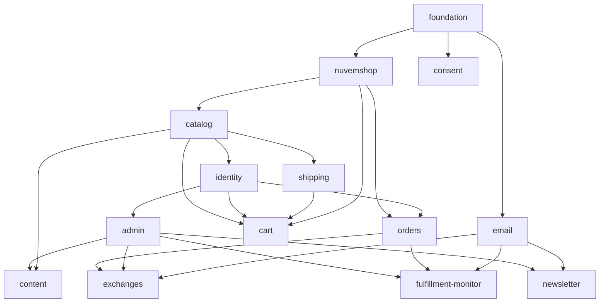

# Mapa de capacidades — MVP Indicio Cult (Fase 1)

| Campo  | Valor                                                                                                                                                          |
| ------ | -------------------------------------------------------------------------------------------------------------------------------------------------------------- |
| Origem | [PRD §6, §9–13](../PRD.md), [ADR-001](../decisions/ADR-001-stack-frontend-cache-estado-e-deploy.md), [ADR-002](../decisions/ADR-002-coolify-traefik-deploy.md) |
| Status | Aprovado em 2026-09-16; arquitetura de deployment readjudicada em 2026-09-24                                                                                   |
| Data   | 2026-09-16 (aprovação original); revisão de deployment: 2026-09-24                                                                                             |

Este mapa decompõe o MVP em módulos independentemente testáveis. Cada módulo recebe o próprio spec (`docs/specs/SPEC-<id>.md`) quando chega a sua vez na ordem de construção. Os ids são estáveis: specs, planos e tarefas referenciam trabalho por id, nunca por nome de arquivo adivinhado.

## Módulos

| Id                    | Responsabilidade                                                                                                                                                                                                                                                                                                                                                                                                                                                                                           | Depende de                                     | PRD                                  |
| --------------------- | ---------------------------------------------------------------------------------------------------------------------------------------------------------------------------------------------------------------------------------------------------------------------------------------------------------------------------------------------------------------------------------------------------------------------------------------------------------------------------------------------------------- | ---------------------------------------------- | ------------------------------------ |
| `foundation`          | Esqueleto Next.js (App Router, TS), grupos de rotas e layouts `(vitrine)` / `(conta)` / `admin`, páginas de sistema (404, 500, manutenção), rota de healthcheck, clientes Supabase (servidor/navegador) e tooling de migrações, variáveis de ambiente, lint/format/test, Docker `standalone` com Dockerfile, recurso Coolify na VPS, Traefik TLS, CI e deploy por API pós-CI com commit pinado, base de observabilidade (erros, helper de eventos de analytics), tokens de design (paleta e tipo do Figma) | —                                              | §8, §14, ADR-001/002                 |
| `nuvemshop`           | Cliente tipado da API Nuvemshop (token só no servidor, escopos mínimos), recepção de webhooks com verificação HMAC, idempotência, despacho por evento e alerta de falha; sem UI                                                                                                                                                                                                                                                                                                                            | `foundation`                                   | §16, ADR-001 §2                      |
| `email`               | Envio transacional com templates da marca (provedor, remetente, layout base); sem UI                                                                                                                                                                                                                                                                                                                                                                                                                       | `foundation`                                   | §16, Apêndice B                      |
| `consent`             | Banner de cookies (aceitar / recusar / configurar) e registro de consentimentos                                                                                                                                                                                                                                                                                                                                                                                                                            | `foundation`                                   | RF-14, §14 LGPD                      |
| `catalog`             | Catálogo `/pecas` com filtros na URL, PDP `/pecas/[slug]` (galeria, variantes, texto da obra, guia de tamanhos, dados estruturados), busca `/busca`, cache ISR por tags e revalidação via `product/updated`                                                                                                                                                                                                                                                                                                | `nuvemshop`                                    | RF-01, RF-02, RF-06, RF-15, §9.3–9.5 |
| `identity`            | Supabase Auth (e-mail/senha, Google), páginas `/entrar`, `/criar-conta`, `/recuperar-senha`, `/redefinir-senha`, `/auth/callback`, sessão, RLS, `/conta` (painel), `/conta/dados`, `/conta/enderecos`, `/conta/favoritos`, `/conta/comunicacoes`, `/conta/excluir`                                                                                                                                                                                                                                         | `catalog` (favoritos exibem peças)             | RF-07, RF-08, §10                    |
| `shipping`            | Proxy `GET /v1/stores/shipping_simulation` da Reserva Ink com rate limit e tratamento dos casos (sem cobertura, prazo sob consulta, sem cotação, `502` com backoff); componente de simulação por CEP na PDP e no carrinho                                                                                                                                                                                                                                                                                  | `catalog`                                      | RF-03, §9.4 item 6                   |
| `cart`                | Store Zustand persistida, mini-carrinho, `/carrinho`, merge ao autenticar, revalidação de itens contra a Nuvemshop, handoff ao checkout hospedado com `begin_checkout`, `/pedido/obrigado`                                                                                                                                                                                                                                                                                                                 | `catalog`, `identity`, `shipping`, `nuvemshop` | RF-04, RF-05, RF-16, §9.7–9.8        |
| `orders`              | Leitura de pedidos Nuvemshop vinculados por e-mail verificado, `/conta/pedidos`, `/conta/pedidos/[id]`, mapeamento de estados, `/rastreio` sem login com rate limit, webhooks `order/paid` / `order/fulfilled` / `order/cancelled` (evento `purchase`, contador de vendas)                                                                                                                                                                                                                                 | `nuvemshop`, `identity`                        | RF-08, RF-11, §7, §9.9, §10.3        |
| `admin`               | Casca do backoffice `/admin`: login com papel `admin` + 2FA TOTP, papéis (`proprietária`, `operação`, `conteúdo`), log de auditoria, layout, dashboard (agregando widgets dos demais módulos), `/admin/configuracoes`, `/admin/usuarios`                                                                                                                                                                                                                                                                   | `identity`                                     | §11                                  |
| `content`             | Séries (`/colecoes`, `/colecoes/[slug]`: texto curatorial, capa, referências, status, ordem, vínculo com categoria Nuvemshop), curadoria da Home `/`, Editorial, Manifesto, páginas de ajuda e legais, avisos globais; edição no backoffice com rascunho/agendamento e revalidação ao publicar                                                                                                                                                                                                             | `admin`, `catalog`                             | RF-12, §9.1–9.2, §9.6, §9.10         |
| `exchanges`           | Formulário `/conta/pedidos/[id]/troca` com regras de prazo (7/90 dias), uma solicitação aberta por pedido, e-mails ao cliente e ao gerente, fila `/admin/trocas` com status e notas internas                                                                                                                                                                                                                                                                                                               | `orders`, `admin`, `email`                     | RF-09, §12                           |
| `fulfillment-monitor` | Saldo e extrato Reserva Ink (`/v1/stores/balance`, `balance_extract`), custo estimado dos pedidos pagos não produzidos, dias de cobertura, alerta por e-mail abaixo do limiar, vendas do mês vs. limite do plano; widget no dashboard e tela `/admin/saldo`                                                                                                                                                                                                                                                | `admin`, `orders`, `email`                     | RF-10, §11, O5                       |
| `newsletter`          | Captura com double opt-in (`/newsletter`, blocos na Home e no Editorial), `/admin/assinantes` com origem, confirmação e exportação; formulário de `/contato` com antispam                                                                                                                                                                                                                                                                                                                                  | `admin`, `email`                               | RF-13, §9.10                         |

## Direção das dependências



Sem ciclos. Contratos entre módulos ficam no spec do **provedor** (ex.: a interface do cliente Nuvemshop é definida em `SPEC-nuvemshop.md`; `catalog`, `cart` e `orders` a consomem).

## Ordem de construção

```
1. foundation
2. nuvemshop, email, consent            (paralelizáveis)
3. catalog
4. identity, shipping                   (paralelizáveis)
5. admin, cart, orders                  (paralelizáveis)
6. content
7. exchanges, fulfillment-monitor, newsletter   (paralelizáveis)
```

Marcos verificáveis por etapa:

| Após | O que dá para demonstrar                                                                                                   |
| ---- | -------------------------------------------------------------------------------------------------------------------------- |
| 1    | Vitrine no Coolify/VPS via Traefik HTTPS com 404 da marca; CI verde; commit pinado e deploy API pós-CI; Supabase conectado |
| 3    | Catálogo e PDP reais lendo a Nuvemshop; preço muda no painel e reflete em segundos                                         |
| 5    | Compra ponta a ponta via checkout Nuvemshop; pedido aparece em `/conta/pedidos`                                            |
| 6    | Operadora publica série e Home sem deploy                                                                                  |
| 7    | Saída do MVP definida no PRD §19 (Fase 1)                                                                                  |

## Preocupações transversais (não são módulos)

- **Analytics e erros**: `foundation` fornece o helper de eventos e o monitor de erros; cada módulo emite os eventos do PRD §14 que lhe cabem (`view_item` em `catalog`, `add_to_cart`/`begin_checkout` em `cart`, `purchase` em `orders`, `sign_up` em `identity`, `newsletter_subscribe` em `newsletter`, `exchange_requested` em `exchanges`).
- **Identidade visual**: paleta e tipografia da fundação vêm do Figma (tabela em `src/styles/tokens.md`). A troca foi só de valores em `@theme`; tokens extras da Home ainda não estão no tema.
- **Copy da marca**: cada módulo usa o tom do PRD §3 nas suas telas; não há módulo de "conteúdo estático".

## Fora do mapa

Fase 2 e 3 do PRD (posters, drops, edições limitadas, vale-presente, avaliações, arquivo público, artistas, EN), checkout próprio, edição de pedido pelo cliente.

## Dependências externas por módulo

| Módulo                                   | Precisa existir antes de implementar                                                               |
| ---------------------------------------- | -------------------------------------------------------------------------------------------------- |
| `foundation`                             | Projeto Supabase ✔, VPS com Coolify/Traefik ✔, repositório remoto ✔; domínio/DNS no Coolify em T15 |
| `nuvemshop`, `catalog`, `cart`, `orders` | Loja Nuvemshop com app de desenvolvedor e token                                                    |
| `shipping`, `fulfillment-monitor`        | Conta Reserva Ink com credencial de API e app instalado na Nuvemshop                               |
| `email`, `exchanges`, `newsletter`       | Provedor de e-mail transacional e domínio de envio autenticado (SPF/DKIM)                          |
| `identity`                               | Credenciais OAuth Google configuradas no Supabase                                                  |
